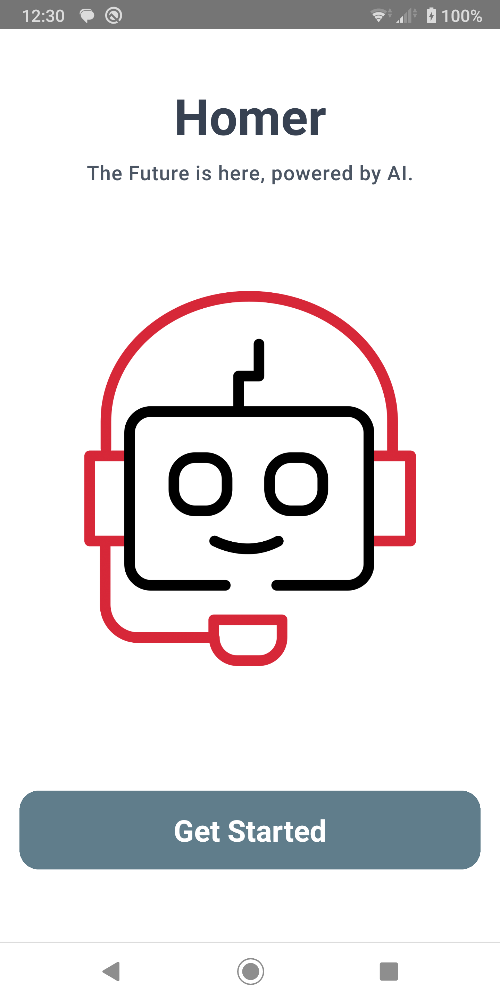
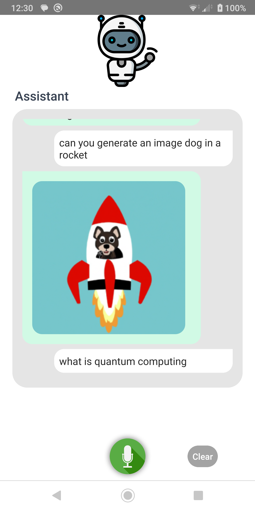

# Speech To Text

Welcome to **Speech To Text**! This guide will walk you through setting up and getting started with the app. Make sure you have the required environment and dependencies in place to smoothly run the application.

## Getting Started

Before you dive into using **Speech To Text**, follow the steps below to ensure a seamless setup:

1. **React Native Environment Setup**: If you haven't already, make sure you've completed the [React Native Environment Setup](https://reactnative.dev/docs/environment-setup) instructions. This will ensure you have the necessary tools and dependencies to work with React Native.

2. **Installation**: To get started, clone this repository to your local machine and navigate to the project directory:

   ```bash
   git clone https://github.com/joblesspoet/react-native-openai-speech-totext.git
   cd react-native-openai-speech-totext
   ```

### Dependencies

Your Application Name relies on the following components:

- [React Native Voice](https://github.com/react-native-voice/voice): This package empowers the application with voice-to-text functionality, allowing users to convert spoken words into written text.

- [OpenAI](https://openai.com/): The application harnesses the capabilities of OpenAI for advanced text chat completion and image generation. To unlock these features, you'll need an OpenAI API Key.

### OpenAI API Key

To enable text chat completion and image generation functionalities, you'll need to obtain an OpenAI API Key. If you haven't already, sign up at [OpenAI](https://openai.com/) to acquire your API Key. Once obtained, you can seamlessly integrate these capabilities into your application.

### Compatibility

Your Application Name has undergone rigorous testing on the Android platform, ensuring a smooth and robust experience. It's important to note that while the Android setup is straightforward, configuring the [React Native Voice](https://github.com/react-native-voice/voice) package for iOS might require additional steps. Rest assured, the provided instructions will guide you through any platform-specific configuration requirements.

### Get Started

Feel free to delve into the application, experiment with its features, and customize it to your preferences. We're thrilled to welcome you aboard and eagerly anticipate your contributions and valuable feedback.

## Screen Shots






## Step 1: Start the Metro Server

First, you will need to start **Metro**, the JavaScript _bundler_ that ships _with_ React Native.

To start Metro, run the following command from the _root_ of your React Native project:

```bash
# using npm
npm start

# OR using Yarn
yarn start
```

## Step 2: Start your Application

Let Metro Bundler run in its _own_ terminal. Open a _new_ terminal from the _root_ of your React Native project. Run the following command to start your _Android_ or _iOS_ app:

### For Android

```bash
# using npm
npm run android

# OR using Yarn
yarn android
```

### For iOS

```bash
# using npm
npm run ios

# OR using Yarn
yarn ios
```

# Troubleshooting

If you can't get this to work, see the [Troubleshooting](https://reactnative.dev/docs/troubleshooting) page.

# Learn More

To learn more about React Native, take a look at the following resources:

- [React Native Website](https://reactnative.dev) - learn more about React Native.
- [Getting Started](https://reactnative.dev/docs/environment-setup) - an **overview** of React Native and how setup your environment.
- [Learn the Basics](https://reactnative.dev/docs/getting-started) - a **guided tour** of the React Native **basics**.
- [Blog](https://reactnative.dev/blog) - read the latest official React Native **Blog** posts.
- [`@facebook/react-native`](https://github.com/facebook/react-native) - the Open Source; GitHub **repository** for React Native.
